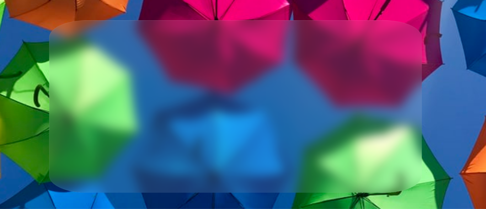

# glass-efect
## esse efeito causa um efeito parecido com vidro
* codigo HTML
````html
  <section>
    <div class="glass">
    </div>
  </section>
````
* codigor CSS
````css
section {
      background-image: url("./bg.jpeg");
      background-repeat: no repeat;
      background-size: cover;
}

.glass {
      background: linear-gradient(135deg, rgba(255, 255, 255, 0.1), rgba(255, 255, 255, 0.1));
      margin: 25% auto;
      width: 70vw;
      height: 70vh;
      backdrop-filter: blur(10px);
      -webkit-backdrop-filter: blur(10px);
      border-radius: 10%;
      border: 1px solid rgba(255, 255, 255, 0.10);
      box-sizing: 0 8px 32px 0 rgba(0, 0, 0, 0.37);
}

````

```` css
    background: linear-gradient(135deg, rgba(255, 255, 255, 0.1), rgba(255, 255, 255, 0.1));
    border: 1px solid rgba(255, 255, 255, 0.10);
    box-sizing: 0 8px 32px 0 rgba(0, 0, 0, 0.37);
    backdrop-filter: blur(10px);
    -webkit-backdrop-filter: blur(10px);
````
## resultado


## feito por [igorrzinho](https://github.com/igorrzinho/)
